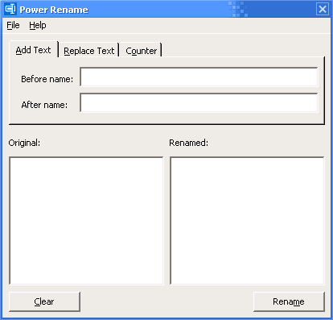
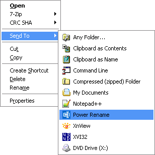

# power-rename

A basic utility for renaming multiple files. Written in Visual Basic 6.

## Releases

Binary versions are available on the [Releases](https://github.com/jcfieldsdev/power-rename/releases) page.

Some very old versions of Windows may require installing the [Visual Basic 6 runtime](https://github.com/jcfieldsdev/power-rename/raw/master/vbrun60-setup.exe), but newer versions have these files preinstalled.

## Guide

Load files into it by selecting "Open" from the *File* menu or by dragging and dropping files onto the program icon. Files must be located in the same folder.

You can also add it to the `SendTo` folder so you can select files in the file manager and rename them through the context menu:

## Acknowledgments

Uses [rename icon](https://www.svgrepo.com/svg/334204/rename) by [SVG Repo](https://www.svgrepo.com).

## Authors

- J.C. Fields <jcfields@jcfields.dev>

## License

- [MIT license](https://opensource.org/licenses/mit-license.php)
